# Sitecore Hackathon 2024

- MUST READ: **[Submission requirements](SUBMISSION_REQUIREMENTS.md)**
- [Entry form template](ENTRYFORM.md)
  
## Team name
⟹ Sitecorelemon

## Category
⟹ Sitecore Hackathon 2025 - Single Category

## Description
⟹ This is a Chrome plugin that can be useful to check if a Sitecore Item is present in XM Cloud preview and Experience edge endpoints - across different projects/environments, once configured. 

### XMC Item Finder Architecture Diagrams
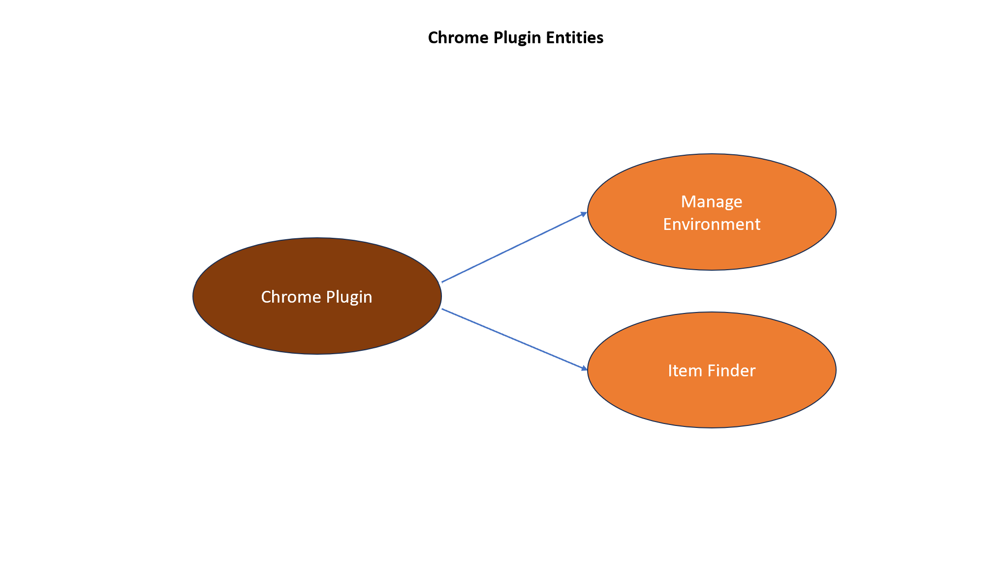
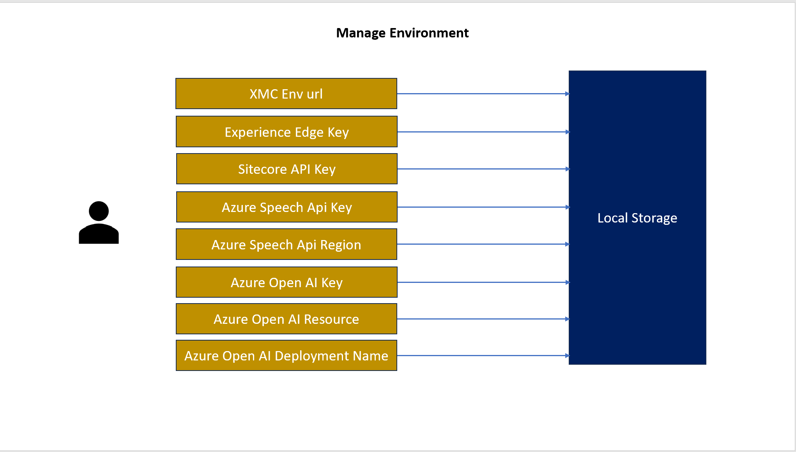
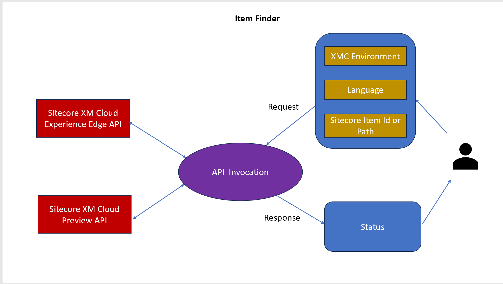
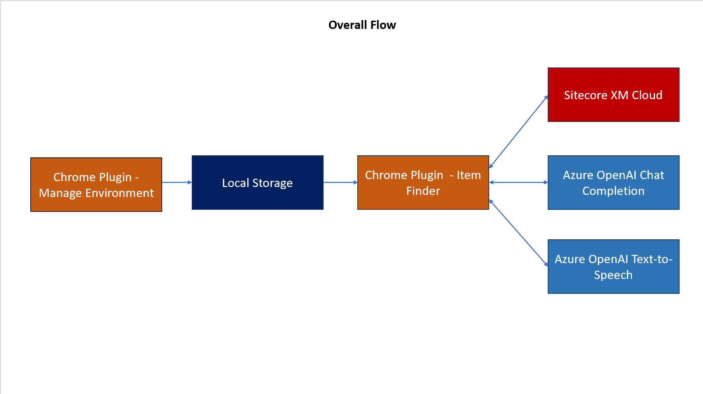

  - Module Purpose

    1. Many times, when content authors and testers are working in higher environments, there is constant confusion if an item exists in Experience edge in a specific environment and there would be a dependency on the technical team to switch between environments or run CLI push/deployment/package install and check for item(s). This plugin negates such a dependency or ball-passing. This plugin also negates the need to run graphql queries by non-technical users like Content authors and testers. 
    2. The second part of the plugin is to see the possibility of using client-side message as prompt to get chat completion, useful in  case of tooltip/help or provide insights about a particular scenario - for instance, if an item is not found in Experience Edge, chat completion responds with the reason and that is passed on to Speech API to output via microphone
  - What problem was solved (if any)
    - How does this module solve it

    1. The module provides a single place to quickly check for items across environments. Content authors and testers will benefit from this plugin since publishing is their bread and butter. Since Content authors and testers will have access to the Sitecore content editor, they have access to the Sitecore item id and path. Also, experience edge doesn't have any graphical UI apart from the actual application front-end. So, this tool can provide a leaner interface to check the status of the item publish and take necessary further steps. 
    2. The idea of integrating Azure OpenAI is to take this further in order to have Azure OpenAI model custom deployments specific to a project or a client and output business-oriented messages.

_You can alternately paste a [link here](#docs) to a document within this repo containing the description._

## Video link
⟹ Provide a video highlighing your Hackathon module submission and provide a link to the video. You can use any video hosting, file share or even upload the video to this repository. _Just remember to update the link below_

⟹ [XMC Item Finder (around 5 mins)](https://youtu.be/qqNU4hXIuP0)

## Pre-requisites and Dependencies

⟹ Does your module rely on other Sitecore modules or frameworks?

- List any dependencies
1. Sitecore XM Cloud Experience Edge key - https://doc.sitecore.com/xmc/en/developers/xm-cloud/generate-an-edge-token.html#generate-an-edge-token-using-the-xm-cloud-deploy-app
2. Sitecore Security API Key - picked from here - master\sitecore\system\Settings\Services\API Keys folder
3. Environment domain in url

Optional:

4. Azure resource region (how-to in below speech section)
5. Azure Speech Key (how-to in below speech section)
6. Azure Open AI resource (how-to in below OpenAI section)
7. Azure Open AI Key (how-to in below OpenAI section)
8. Azure Open AI Deployment name (how-to in below OpenAI section)

- Or other modules that must be installed

No installation is required apart from this plugin
- Or services that must be enabled/configured

Although optional, if you want to utilise Azure-related AI functionality, 
For Speech, follow this:
1. An Azure subscription. You can create one for free.
2. Create an AI Services resource for Speech in the Azure portal.
3. Get the Speech resource key and region. After your Speech resource is deployed, select Go to resource to view and manage keys - https://youtu.be/4_20T3MTlCU?si=_ajQodRLTeNiKp0h&t=94

For deploying an Azure OpenAI chatGPT model follow these steps:
1. Sign in to Azure Portal: Go to the Azure portal and sign in with your Microsoft account. 
2. Create an Azure OpenAI resource:
3. Navigate to "Cognitive Services" or search for "Azure OpenAI". 
4. Click "Create" and provide necessary details like subscription, resource group, and region. 
5. Access Azure AI Foundry portal:
6. Once the resource is created, go to the "Azure AI Foundry" portal. 
7. Select a model to deploy: In the left sidebar, go to "Deployments". 
8. Click "Create new deployment". 
9. Choose a model from the available options, like "GPT-3.5 Turbo". 
10. Configure deployment settings: Provide a unique deployment name. 
11. Select the deployment type (Standard, Global Standard, etc.). 
12. Set the "Tokens per Minute Rate Limit" if needed. 
13. Deploy the model: Click "Deploy" to initiate the deployment process. 

Once the chat model is deployed, you can get the deployment name, resource name and OpenAI key  - https://www.youtube.com/watch?v=4DiTF8k0b0U&t=17s

## Installation instructions
⟹ Write a short clear step-wise instruction on how to install your module. 

 The chrome plugin will be available only after plugin store review since it was submitted as part of the hackathon. So, until then follow this interim process to install the plugin manually:

1. Download the code as zip file from the repo - 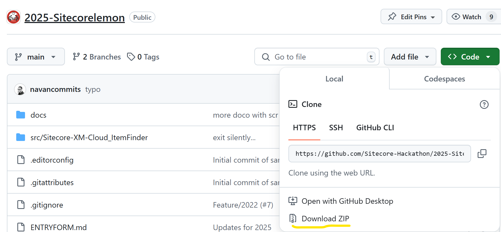
2. Extract the zip: Unzip the downloaded file to see the plugin folder with manifest.json and popup.html - <download path>\2025-Sitecorelemon-main\2025-Sitecorelemon-main\src\Sitecore-XM-Cloud_ItemFinder 
3. Access Chrome extensions page: Go to "chrome://extensions" in your Chrome browser. 
4. Enable Developer mode: Toggle the "Developer mode" switch in the top right corner. 
5. Load unpacked: Click "Load unpacked". 
6. Select the folder: Navigate to the extracted plugin folder and select it to install - <download path>\2025-Sitecorelemon-main\2025-Sitecorelemon-main\src\Sitecore-XM-Cloud_ItemFinder
7. Extension gets added like this - 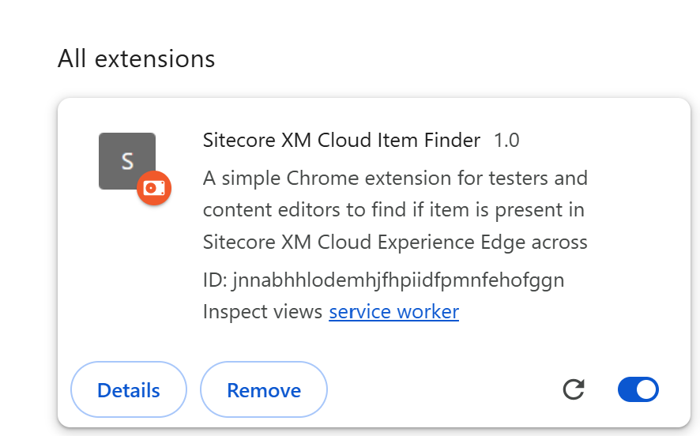

> Once the plugin is available in the Chrome store, the installation is similar to how Chrome plugins are installed from the plugin store. The process is as follows:

1. Open the Chrome Web Store: Navigate to "chrome://webstore" in your Chrome browser. 
2. Search for the plugin: Use the search bar to type the name of the plugin you want to install. 
3. Select the plugin: Click on the desired plugin from the search results. 
4. Install the plugin: Click "Add to Chrome" on the plugin page. 

### Configuration
⟹ If there are any custom configuration that has to be set manually then remember to add all details here.

Such configurations are part of manage environment section in the plugin 

## Usage instructions
⟹ Provide documentation about your module, how do the users use your module, where are things located, what do the icons mean, are there any secret shortcuts etc.

1. Once the plugin is installed, you can pin it to the browser bar: 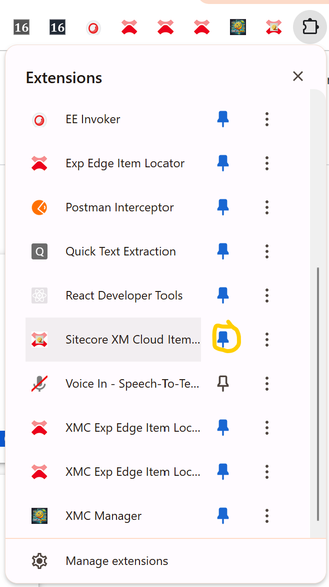
2. Thereafter click the icon  from browser bar
3. First time, setup environment details - 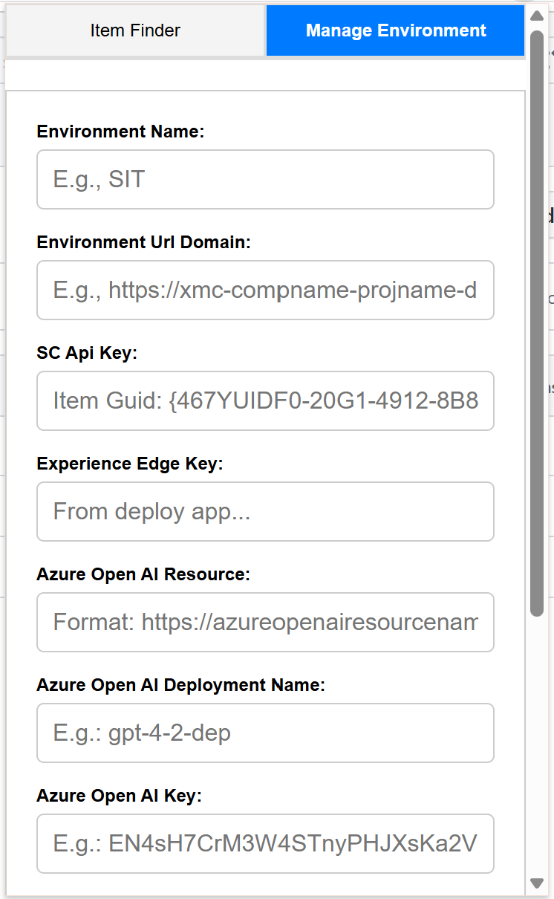
4. Once setup, environment will be selectable in drop down in Item Finder tab - 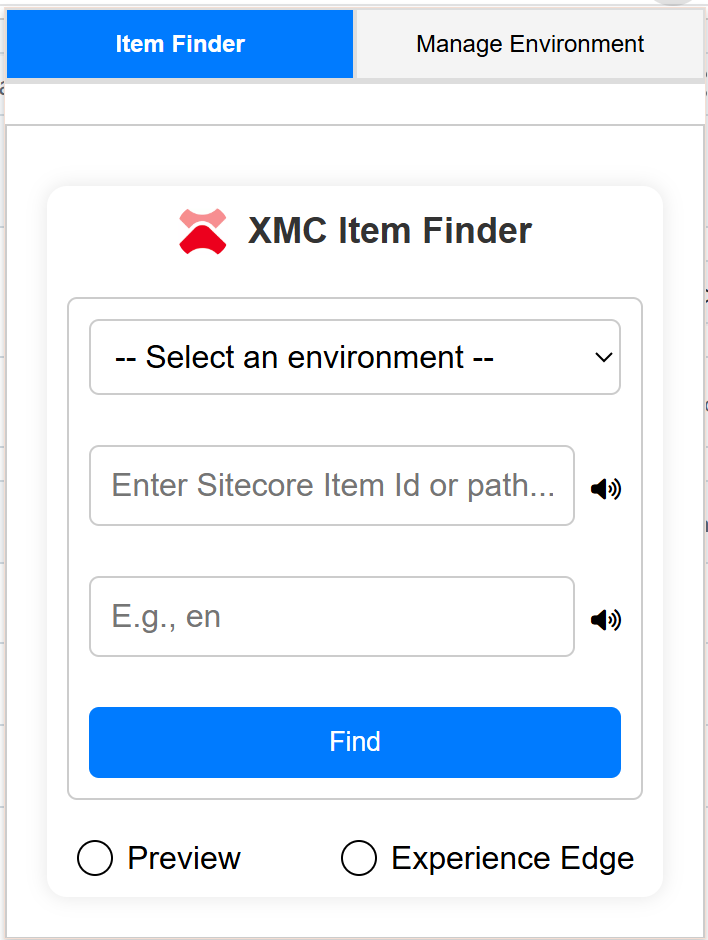
5. Select the environment and enter item path or id and language to find the item state
6. Non-existent item:
7. Not published item: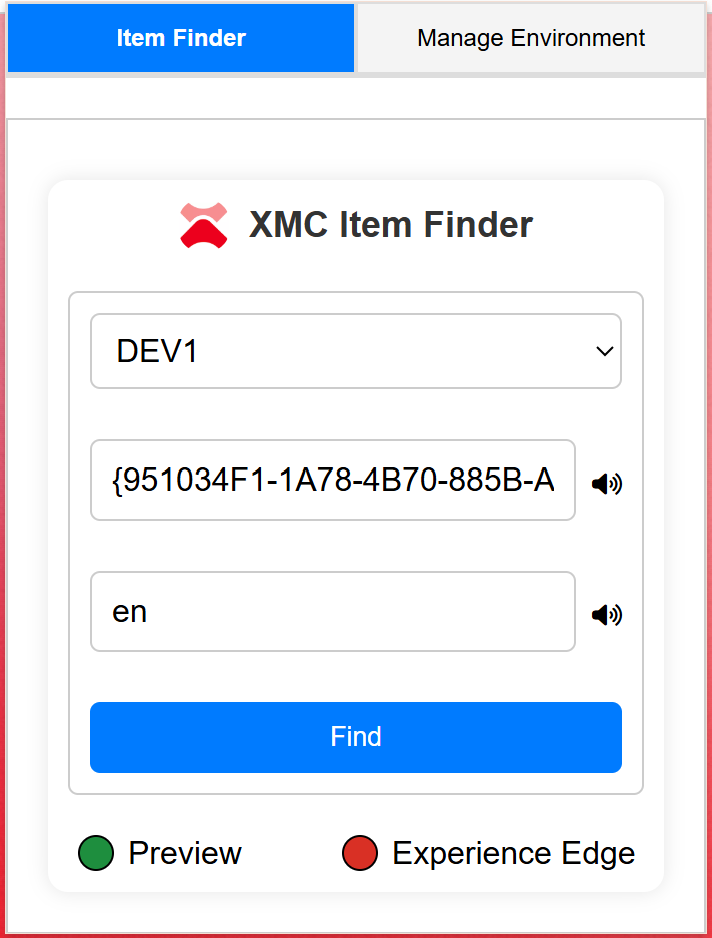
8. Published item: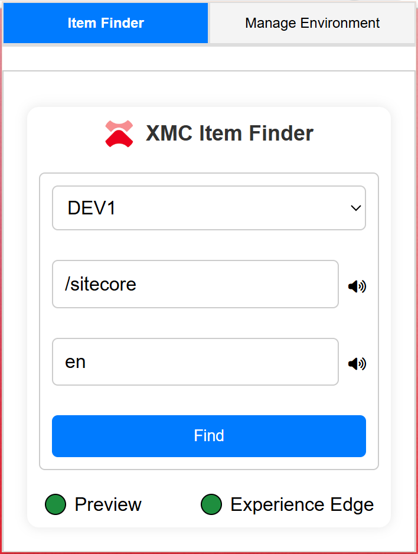
9. If Azure OpenAI is configured in manage environment, use speaker icon to get contextual tooltip - 

## Comments
It is good to test this module in your own XMC environment since that is the whole purpose of this plugin but I can share Azure keys to the judges based on request. Also, the demo video does showcase all the capabilities of the plugin.
